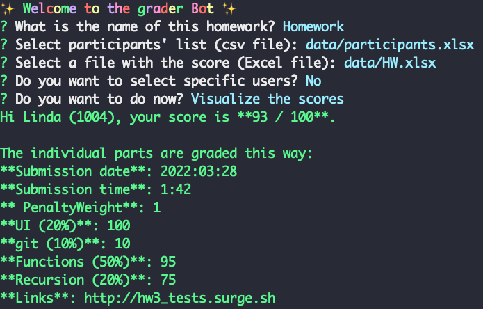

# 🤖 Discord Bot

Send direct private message to students with a bot to let them know about their score.

To get started, add some data to the `data` folder. See an [example here](example).

Make sure also to create a `.env` file in the root folder and add your bot token. For example (an obviously fake token here...):

```
TOKEN=OTasdfasdfE2Mjkxasdfasdfw.Yhb4Cg.Hx_asdfasdfasdfasdf
```


